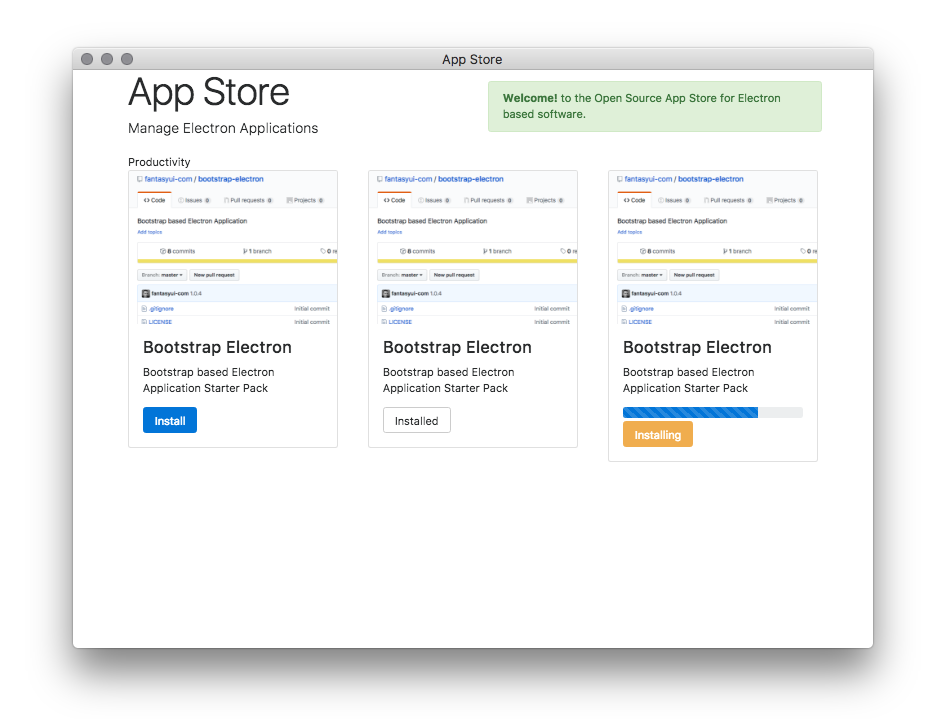

# App Store

Open Source App Store for Electron Apps.


Alpha Screenshot

## Goal

Bring Simple Electron/Node based GUI Applications to the Node user.

## Launch/Usage

```

  npm i -g epx;
  epx app-store

```

## Making Apps

Clone https://github.com/fantasyui-com/bootstrap-electron to get started.

## Publishing Apps

An open catalog of npm package names and public git repositories will be generated based on a public search for unique tags/keywords, it will be published to github for review/testing. App-store will periodically pull the list to keep up to date.
