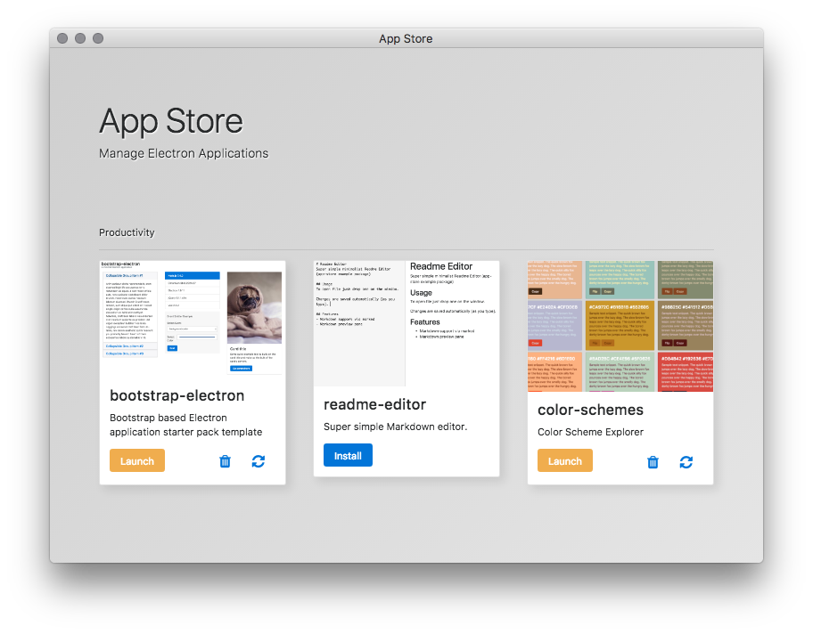

# App Store
Flexible general purpose app-store framework with customizable app feeds.
Bring powerful, simple, minimalist Electron/Node based apps to the user.

## App Store Installation

[Downloads](downloads) folder contains downloads for Linux, Mac, and Windows.

Windows users please download [app-store-windows-64.zip](https://github.com/fantasyui-com/app-store/raw/master/downloads/app-store-windows-64.zip) unless you have an older [32bit] setup where [app-store-windows-32.zip](https://github.com/fantasyui-com/app-store/raw/master/downloads/app-store-windows-32.zip) will work.

Mac users please download [app-store-mac-x64.zip](https://github.com/fantasyui-com/app-store/raw/master/downloads/app-store-mac-x64.zip)

Linux build is available under [app-store-linux-x64.zip](https://github.com/fantasyui-com/app-store/raw/master/downloads/app-store-linux-x64.zip)

## Roadmap

1. Super Easy Download/Install inspired by the [Portable Application](https://en.wikipedia.org/wiki/Portable_application) concept. Simple app-store.exe installer (or just simple executable) for Windows, Mac, and Linux Operating Systems.
2. App Store will support multiple software catalogs called feeds. Users will be able to add/remove software catalog feeds to customize their homepage.

Alpha Screenshot



## Development Launch/Usage (Node.js users)

Install [Node.js](https://nodejs.org/en/download/) and execute the following in your in terminal/command shell.

```
  npm i -g epx; # install epx on your system
  epx app-store # launch app-store with epx

```

## Making Apps

Clone https://github.com/fantasyui-com/bootstrap-electron to get started.

## Publishing Apps

An open catalog of npm package names and public git repositories will be generated based on a public search for unique tags/keywords, it will be published to github for review/testing. App-store will periodically pull the list to keep up to date.

## Ideas

- Desktop Mode, show applications as icons on a desktop-like screen.

## Snippets

electron-builder --win --ia32 --prepackaged ./win32-x64/
gulp=spawn(process.env.SHELL, ['-c', 'cd ' + project.directory + ' && gulp'])
childProcess.execFileSync(process.env.SHELL, ['-c', 'launchctl setenv PATH "$PATH"'])
asar pack . app.asar ; cp app.asar /Users/-/Downloads/Electron.app/Contents/Resources/default_app.asar
